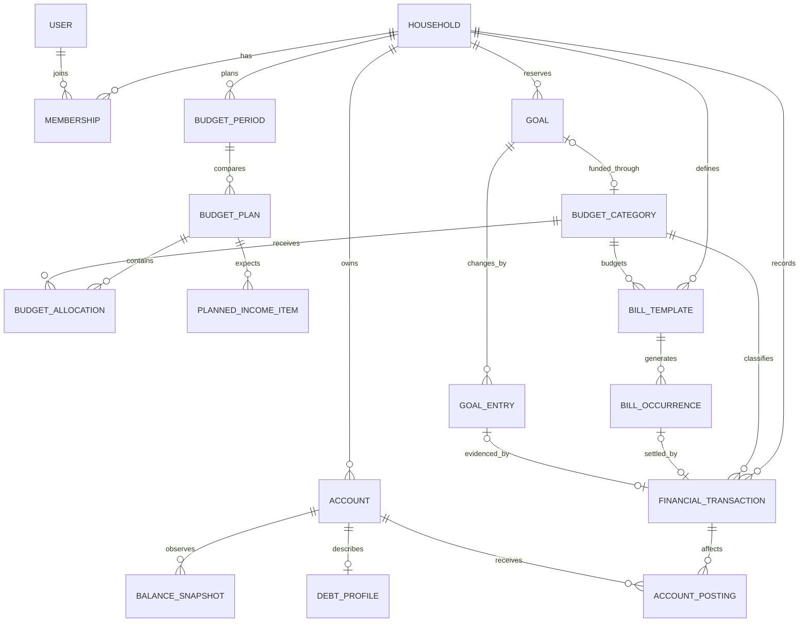

# Domain Model

## 1. Purpose

This document defines the language, boundaries, relationships, and invariants of the application. It is the conceptual model; the physical schema is defined in `11-database-design.md`.

The model intentionally supports household planning rather than full general-ledger accounting. It preserves enough history to explain every displayed number and leaves clear seams for imports and more detailed reconciliation later.

## 2. Domain Boundaries

### Household and Identity

Owns household settings, membership, currency, and timezone. V1 has exactly one household and two equal members, but financial records still carry a `household_id` so ownership is explicit and accidental cross-household reads are impossible.

First-run household creation is allowed only from the Mac mini itself. The first member creates a short-lived invitation for the second member. Its one-time URL may be rendered as a QR code for phone setup; accepting it creates the second equal-permission account and consumes the invitation.

Financial ownership and reporting are household-wide. Actor/member identity answers who recorded or changed something; it does not create individual balances, allocations, goals, or dashboard totals.

### Accounts

Tracks where money or debt is held. An account is classified as an asset or liability. Users periodically record observed balance snapshots; transactions recorded after the latest snapshot may be used to show a projected balance.

### Transactions

Records economic events that have happened: purchases, income, transfers, refunds, and corrections. A transaction may affect a budget category, one or more accounts, both, or neither when account information is intentionally omitted.

### Budgeting

Defines calendar-month plans. A plan contains allocations for fixed, flexible, and reserved categories plus planned income. A period has one active plan and may have any number of isolated scenarios.

### Bills and Subscriptions

Separates a recurring definition from each concrete obligation. A bill template describes the schedule; a bill occurrence represents the amount and due date for a specific month. A subscription is a bill template with cancellation-analysis behavior.

### Goals and Sinking Funds

Tracks virtually reserved cash using an append-only entry history. A goal may represent a target-based savings goal or a reusable sinking fund. It does not have to correspond to a separate bank account.

All V1 goals reserve cash. Informational targets that do not reduce available-to-spend are a different future concept and must not overload `Goal`.

### Debt

Adds payoff metadata to a liability account. The account owns the observed balance; the debt profile owns APR, minimum payment, and planning preferences.

### Reporting and Planning

Calculates dashboard metrics, status, scenario projections, and historical summaries from the domains above. It does not own a second copy of the underlying financial truth.

## 3. Ubiquitous Language

| Term | Meaning |
| --- | --- |
| Observed balance | A balance manually reported as true for an account at a particular time. |
| Projected balance | The latest observed balance adjusted by known account postings after its effective time. |
| Liquid account | An asset account whose funds may support near-term household spending. |
| Budget period | One household-local calendar month. |
| Budget plan | A complete set of planned income and category allocations for a period. |
| Active plan | The official plan used by the dashboard for a period. |
| Scenario | An editable, isolated candidate plan that has no operational effect until adopted. |
| Allocation | The amount assigned to one category in one plan. |
| Actual spending | Non-voided spending transactions in a category during a period. |
| Bill template | The reusable definition and recurrence schedule of an obligation. |
| Bill occurrence | One dated obligation produced from a bill template, or entered directly. |
| Reserved cash | Cash virtually committed to goal balances or other explicit reserves. |
| Available to spend | Liquid cash and expected remaining income less cash-settled short-term liabilities, known fixed obligations, explicit reserves, and the household minimum cash buffer. |
| Projected month-end free cash | Available-to-spend less planned remaining flexible spending. |

## 4. Aggregate Ownership

An aggregate is the consistency boundary changed by one use case and one database transaction.

| Aggregate root | Owns | Important operations |
| --- | --- | --- |
| Household | memberships, invitations, settings | bootstrap household, invite second member, change timezone |
| Account | balance snapshots | record balance, disable account, calculate projected position |
| Financial transaction | account postings | record purchase, income, transfer, refund, void or replace transaction |
| Budget period | active-plan pointer, close state | open period, adopt scenario, begin/finish review, explicitly reopen |
| Budget plan | allocations, planned income items | create scenario, adjust allocation, compare plan |
| Bill template | schedule | change future schedule, generate occurrences, disable subscription |
| Bill occurrence | payment link and status | revise estimate, mark paid, skip or cancel occurrence |
| Goal | goal entries | contribute, withdraw, correct balance, archive goal |
| Debt profile | payoff settings | change APR/payment assumptions, calculate payoff projection |

Cross-aggregate changes such as marking a bill paid are coordinated by an application action inside one database transaction.

## 5. Relationship Overview

## 6. Key Entity Behavior

### Accounts and balances

- Asset balances are displayed as positive resources; liability balances are displayed as positive amounts owed.
- Internally, an account posting is a signed change in household net position. A checking purchase is negative. A credit-card purchase is also negative because it increases a liability. A credit-card payment creates a negative posting to checking and a positive posting to the credit card, totaling zero.
- A manual balance snapshot supersedes projections before its `effective_at` time. It does not delete transactions or postings.
- Net worth uses projected asset position minus projected liability position and includes non-liquid accounts.
- Available-to-spend uses only accounts explicitly marked liquid.
- Projected balances of liabilities explicitly marked as short-term cash reservations, normally credit cards, are subtracted from available-to-spend. Long-term debt principal is not.

### Transactions

- Amounts are positive minor-unit magnitudes; type and account postings provide direction.
- A V1 spending transaction has exactly one category. The schema does not require transaction splitting before the product needs it.
- A transfer has at least two postings whose signed amounts total zero. It may reference a `reserved` category to fulfill a goal/investment contribution allocation; this is budget progress, not spending.
- A transaction is never silently deleted after it affects reporting. Mistakes are voided or replaced with an audit trail.
- Immediate quick-entry undo is a predefined audited void operation, not deletion.
- A credit-card payment is a transfer, never spending.

### Budget plans and scenarios

- A budget period is identified by the first day of a household-local month.
- A period has exactly one active plan after setup.
- A scenario is copied from an explicit base plan. Editing it does not update that base.
- Adopting a scenario atomically snapshots its current contents as the new active plan and supersedes the previous active plan. The adopted revision is not edited in place.
- Adoption creates pending execution actions for assumptions requiring a real-world step, such as cancelling a subscription. Until completed, known obligations remain reserved.
- Fixed allocations cannot be adjusted in a normal scenario. A subscription may be disabled in a scenario because that operation models cancellation, not arbitrary underbudgeting.
- Subscription assumptions belong to individual bill templates with an effective date. They affect only scenario calculations until adoption explicitly resolves the real-world cancellation.
- Actual spending belongs to the period and category, not to a particular plan. This allows scenarios to be compared against the same reality.
- Next-period preparation idempotently creates a copied baseline active revision on the 25th; later user changes occur through revisions/scenarios, never silent mutation.

### Bills

- Templates generate occurrences idempotently for a rolling horizon.
- Recurrence is an explicit anchored day/week/month/year interval; semimonthly income uses two schedules and month-end fallback preserves the intended day.
- Edits to a template change future, unmodified occurrences only. A concrete occurrence preserves what was expected for its month.
- Marking an occurrence paid records or links one financial transaction, preventing a second expense entry.
- The actual paid amount replaces that occurrence's estimate. Updating the template default is a separate explicit choice and affects only future unmodified occurrences.
- Known unpaid occurrences refine the fixed reservation. They are not added again on top of their entire fixed-category allocation.
- Disabling a bill template does not erase historical occurrences.

### Goals

- A goal balance is the sum of its non-voided entries; it is not an independently editable total.
- Contributions are positive reservations, withdrawals are negative, and explicit corrections require a reason.
- Withdrawals may create a negative balance only after explicit confirmation; the goal is then visibly overdrawn.
- A linked bank transfer is evidence of moving money between accounts but is not required because a goal can be virtual.
- Spending from a sinking fund reduces both actual cash and the reserved goal balance. The calculation therefore avoids making the household appear poorer twice.
- The purchase and goal withdrawal commit atomically and are linked; a reserved-category purchase never masquerades as a contribution.

### Debt

- Every debt profile belongs to one liability account.
- The latest projected account balance is the current debt balance shown to users.
- Payoff projections are derived results. Assumptions used for a saved comparison are stored with that comparison rather than written back to the account.
- When an amortizing payment lacks an exact principal split, V1 records the fixed cash outflow and relies on a later liability observation rather than guessing the account posting.

## 7. Cross-Domain Invariants

1. Every financial record belongs to the same household as all records it references.
2. Money is stored as signed 64-bit minor units and never as binary floating point.
3. V1 performs arithmetic in one household base currency. Cross-currency arithmetic is rejected until exchange-rate behavior is designed.
4. Financial dates use the household timezone; persisted timestamps use UTC.
5. Only non-voided transactions affect actuals, account projections, and reports.
6. Exactly one active budget plan exists for an open period.
7. Scenario records never affect dashboard values until adoption succeeds.
8. A paid bill occurrence links to at most one non-voided payment transaction.
9. A transfer's account postings total zero.
10. A liability account cannot be marked liquid.
11. Disabled categories, accounts, goals, and bill templates remain queryable for history.
12. Calculated metrics are reproducible from persisted inputs; AI output is never a financial input.
13. Closed periods reject normal financial writes until explicitly reopened with an audited reason.
14. Negative goal balances are preserved as reality, but reserved-cash calculations floor each goal's contribution at zero.
15. Monthly headline status is derived by fixed precedence: overallocated, over budget, attention needed, then on track; all applicable reason codes remain visible.
16. Member identity never partitions household financial calculations; it is used for authentication, audit, activity, and optional history filtering only.
17. Category allocations do not roll forward automatically; an explicit month-end rollover is capped by unused source allocation and actual positive free cash.
18. Scenario subscription overrides never mutate bill templates or occurrences.
19. Adopting a planned external action never marks the real action complete; unresolved obligations remain reserved until confirmed.
20. Every V1 goal reserves cash; non-reserving informational targets are outside the model.
21. Categorized transfers may fulfill only reserved allocations and never count as spending or alter net worth.

## 8. Commands and Queries

Representative commands change state:

- `RecordPurchase`
- `RecordIncome`
- `RecordTransfer`
- `RecordAccountBalance`
- `CreateBudgetScenario`
- `ChangeScenarioAllocation`
- `AdoptBudgetScenario`
- `GenerateBillOccurrences`
- `MarkBillPaid`
- `ContributeToGoal`
- `WithdrawFromGoal`
- `CloseBudgetPeriod`

Representative queries return read models without changing state:

- `GetMonthlyDashboard`
- `GetAvailableToSpendBreakdown`
- `GetBudgetProgress`
- `CompareBudgetScenarios`
- `GetUpcomingBills`
- `GetNetWorthHistory`
- `GetGoalForecast`
- `GetDebtPayoffProjection`

These names describe application use cases, not necessarily controllers or public APIs.
