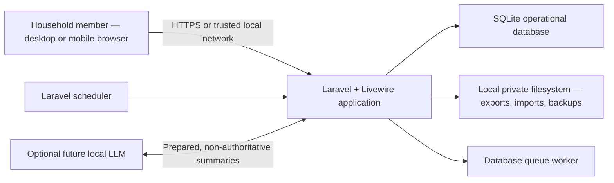
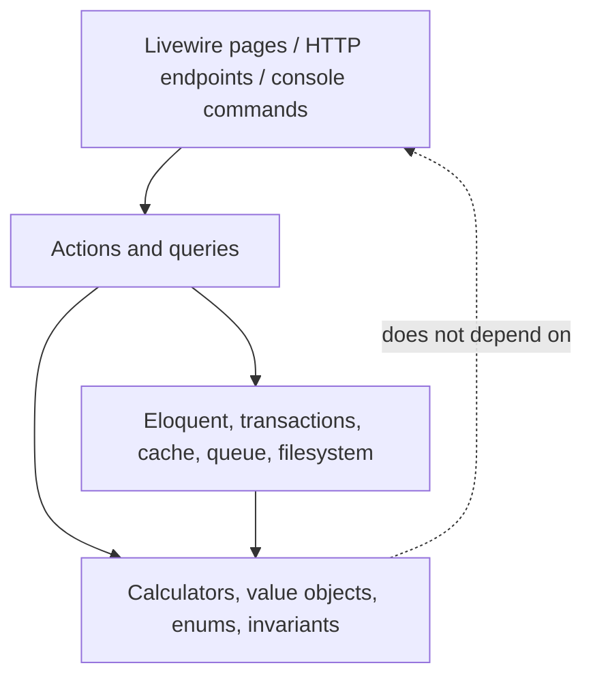
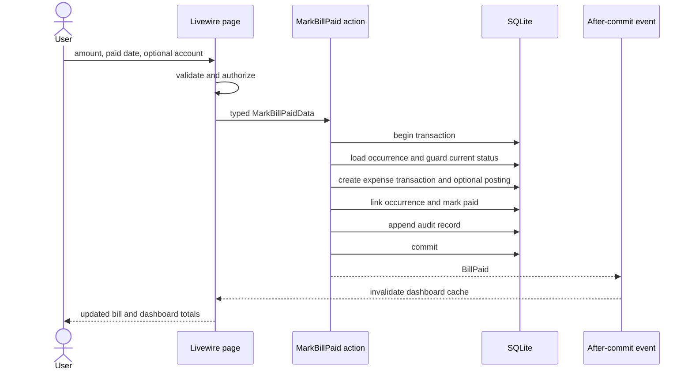

# Technical Architecture

## 1. Decision Summary

Build a server-rendered modular monolith using:

- Laravel 13 on PHP 8.3 or newer.
- The official Livewire starter kit with Livewire 4, Blade, Tailwind CSS, and Flux UI.
- SQLite for the local authoritative database.
- Laravel's built-in session authentication, validation, authorization, scheduling, database transactions, cache, filesystem, and database-backed queue.
- Pest for automated tests, Laravel Pint for formatting, and Larastan/PHPStan level 6 for static analysis.

This stack is intentionally one deployable application, one database, and one primary language. It is enough for two concurrent household users, supports a responsive reactive UI, and keeps all financial logic on the trusted server.

## 2. System Context



No bank, email, analytics, AI, or cloud service is required for core operation.

## 3. Architectural Style

### Modular monolith

Organize code by business capability while deploying one Laravel application. Modules are logical boundaries, not Composer packages or microservices:

```text
app/
├── Domain/
│   ├── Accounts/
│   ├── Bills/
│   ├── Budgeting/
│   ├── Debt/
│   ├── Goals/
│   ├── Household/
│   ├── Reporting/
│   ├── Shared/
│   └── Transactions/
├── Http/
├── Livewire/
├── Models/
├── Policies/
└── Providers/
```

Recommended responsibilities inside a domain module:

```text
Budgeting/
├── Actions/          # one state-changing use case per class
├── Calculators/      # pure deterministic financial calculations
├── Data/             # immutable input/output DTOs
├── Enums/            # backed domain enums
├── Events/           # facts emitted after successful changes
├── Exceptions/       # meaningful invariant failures
└── Queries/          # read-model assembly, no state changes
```

Keep Eloquent models together in `app/Models` initially so Laravel conventions, factories, policies, and relationships stay obvious. Move models into modules only if the benefit becomes concrete.

### Dependency direction



- UI components validate presentation input, authorize the operation, invoke one action/query, and render a result.
- Actions coordinate models and infrastructure inside an explicit transaction.
- Calculators consume typed data and return typed results without querying the database.
- Queries may use Eloquent or the query builder directly to create purpose-built read models.
- Eloquent models express relationships, casts, scopes, and local state rules; they do not become catch-all service objects.

## 4. Request and Write Flow

Example: mark a bill paid.



The linked expense is created in the same transaction as the paid status. A queue is not used for correctness-critical work.

## 5. Laravel Capability Map

| Need | Laravel capability | Usage |
| --- | --- | --- |
| Authentication | Official starter kit / Fortify-backed auth | Built-in email/password; public registration disabled after household setup; optional 2FA |
| Household access | Middleware, policies, gates | Resolve the authenticated household and authorize every record operation |
| Input validation | Livewire form objects and reusable validation rules | Normalize money/date input before creating typed command data |
| Persistence | Eloquent, relationships, casts, query builder | Conventional writes; explicit aggregate loading; optimized reporting queries |
| Atomic changes | `DB::transaction()` | Plan adoption, bill payment, transfers, goal entries, month close |
| Concurrency | optimistic `lock_version`, unique constraints, row locks where supported | Prevent stale scenario overwrite and duplicate occurrence/payment creation |
| Domain facts | Laravel events dispatched after commit | Cache invalidation, activity updates, optional future notifications |
| Background work | Database queue | CSV parsing, exports, long projections, optional local AI summaries |
| Recurring work | Scheduler | Generate bill/income occurrences, backups, maintenance, month setup |
| Files | Private filesystem disks | Imports, exports, and backups outside `public` |
| Read performance | Query builder, eager loading, `Cache::remember` | Dashboard read model, only after correctness and measurement |
| Serialization | API resources / typed view models | Stable output boundary for Livewire charts and future local API |
| Observability | structured logs, health route, failed jobs | Local operational diagnosis without external telemetry |
| Testing | model factories, database assertions, time travel, queue/event fakes | Unit, feature, integration, and scheduled-task tests |

## 6. Frontend Architecture

Choose the Livewire starter kit because the product is form- and dashboard-heavy, the team can keep financial types and validation in PHP, and the app does not require a separate public API or offline browser database.

Use:

- Full-page Livewire components for dashboard, accounts, monthly budget, scenario planner, bills, goals, debt, reports, and settings.
- Smaller Livewire components only for independently updating regions such as quick purchase, bill list, and scenario totals.
- Livewire form objects for multi-field forms.
- Blade/Flux components for repeated visual primitives and accessibility behavior.
- Alpine only for ephemeral browser behavior that does not own financial truth, such as opening a sheet or previewing a slider while a request is debounced.
- Server-returned calculation results after every committed scenario change; browser arithmetic may preview but never becomes authoritative.

Avoid a global client state store in V1. The URL should carry selected month, account, or scenario identifiers so screens remain refreshable and shareable between household members.

## 7. Calculation Architecture

Financial calculations are pure domain services, for example:

- `AccountPositionCalculator`
- `AvailableToSpendCalculator`
- `BudgetProgressCalculator`
- `FixedReservationCalculator`
- `MonthlyStatusCalculator`
- `GoalForecastCalculator`
- `ScenarioProjectionCalculator`
- `DebtPayoffCalculator` (later milestone)

Each calculator:

1. Accepts immutable DTOs containing integers, dates, and enums.
2. Performs no Eloquent queries, HTTP calls, cache reads, queue dispatch, or AI calls.
3. Returns a result object with both totals and labeled components needed to explain the total.
4. Defines rounding at the boundary where division occurs.
5. Allows negative results unless the specific quantity is inherently non-negative.

Queries are responsible for loading and normalizing persisted input. Calculators are responsible for math. Livewire is responsible for presentation.

## 8. Dashboard Read Model

`GetMonthlyDashboard` assembles one immutable read model containing:

- calculation timestamp and data freshness warnings;
- available-to-spend total and breakdown;
- short-term liability reservation, normally projected credit-card balances;
- projected month-end free cash;
- expected and received income;
- allocation, actual, and remaining amount by section/category;
- upcoming and overdue bills;
- projected account balances and latest observation dates;
- goal progress;
- debt summary;
- net worth;
- deterministic status and reason codes.

`MonthlyStatusCalculator` evaluates all reasons, then selects one headline using the documented severity precedence. It never stops after finding the first reason and never persists a mutable status column.

The dashboard has no member scope. Queries always calculate the household totals. Transaction/activity screens may accept an `entered_by_user_id` filter, but that filter is never passed into financial calculators or reused for household totals.

Compute this synchronously from indexed queries in V1. Cache only if measurement shows a problem. If cached, key by household/month plus a household financial-data version that is incremented after relevant commits; do not use an arbitrary stale time for correctness.

## 9. Authentication and Authorization

- Use Laravel's session guard and secure, HTTP-only, same-site cookies.
- Permit first-run household bootstrap only from a loopback request on the Mac mini, then disable bootstrap permanently.
- Add the second member through an authenticated, 30-minute, single-use invitation. Render the invitation URL as a QR code and copyable fallback; the recipient chooses their own password during acceptance.
- Store only a SHA-256 token hash, consume it atomically, enforce the two-member limit, and never embed a password or personal data in the QR code.
- The receiving device must trust the household CA before opening the invitation.
- Do not add a roles package for two equal members.
- Policies check membership and record ownership for accounts, plans, scenarios, transactions, bills, goals, debts, imports, and exports.
- Use password confirmation for sensitive operations such as export, restore, changing household membership, and deleting/voiding broad ranges of data.
- Enable CSRF protection, login rate limiting, secure cookies under HTTPS, and optional TOTP 2FA.
- Use 12-character mixed passwords, a 24-hour inactivity session, no persistent remember-me cookie, and 5 login attempts per minute per normalized email/IP.
- Never expose the SQLite file, `.env`, logs, imports, exports, or backups through the web root.

## 10. Scheduling and Queues

Run the scheduler once per minute using the host's cron/launch mechanism. Scheduled commands should be safe to run repeatedly:

- materialize bill occurrences for the next 90 days;
- materialize expected income occurrences;
- create the next budget period from an explicit template/copy rule;
- produce verified rotating backups;
- prune failed jobs, sessions, and expired temporary import data;
- later, calculate optional insights.

Use the database queue initially to avoid Redis. Queue jobs must be idempotent and carry identifiers, not serialized mutable financial aggregates. A failed job must not leave a bill half-paid or a scenario half-adopted because core writes happen synchronously before dispatch.

## 11. Data Freshness and Manual Reconciliation

Manual balance tracking creates an honest distinction:

- **Observed** means directly entered from the institution/cash count.
- **Projected** means observed plus known postings recorded after that observation.
- **Stale** means no observation within a configurable age.
- **Incomplete** means no observation exists.

Every balance-driven card should show its `as of` time or a freshness indicator. Recording a new observation does not mutate old transactions; it simply establishes a new projection baseline.

## 12. Failure Handling

- Expected invariant failures throw domain-specific exceptions that the UI converts to actionable messages.
- Unexpected failures are logged with request/correlation ID, user ID, household ID, action, and safe identifiers.
- Do not log full form payloads, notes, imported rows, credentials, or financial export content.
- Validation failure keeps user-entered values where safe.
- Duplicate retries return the already-created occurrence/import result or a clear conflict instead of creating another row.
- A visible failed-jobs screen or maintenance command is sufficient for the household deployment; external telemetry is optional.

## 13. Deployment Shape

V1 deployment target:

```text
One household Mac mini
├── web process (Laravel/PHP), reachable on the Mac and trusted home LAN
├── queue worker
├── scheduler trigger
├── SQLite database on local persistent storage
├── private application storage
└── backups on a separate local/encrypted destination
```

Both members may use the Mac mini directly or connect from phones/computers through its private LAN address and configured port. V1 does not support public internet exposure, router port forwarding, a third-party sharing tunnel, or remote access away from the home network.

HTTPS is mandatory for LAN access. The runtime uses `https://financials.local:8443` as its canonical `APP_URL`, with a certificate issued by Caddy's internal household-local CA. The CA root is installed and explicitly trusted on each approved phone/computer. There is no authenticated HTTP fallback.

Development uses Laravel Herd's `.test` site. The persistent household runtime uses native FrankenPHP/Caddy in classic mode on port 8443 and must:

- use a web server directed only at Laravel's `public` directory, never the repository root;
- bind only to localhost and/or the intended private LAN interface;
- use a fixed LAN address or documented local hostname so bookmarks remain stable;
- terminate HTTPS with the locally trusted certificate and keep secure, HTTP-only, same-site session cookies enabled;
- start the web process, queue worker, and scheduler after Mac restart/login;
- run with `APP_ENV=production`, `APP_DEBUG=false`, cached configuration/routes/views, and private writable storage;
- keep macOS firewall enabled and avoid opening the port on the internet router;
- document health-check, restart, update, backup, and restore commands.

Herd is development tooling only; its `.test` hostname is not the household endpoint. Laravel's built-in development server and Octane worker mode are not used for the unattended V1 runtime.

The deployment runbook must include CA creation/storage, server-certificate renewal, macOS/iOS device trust instructions, certificate revocation/replacement, and removal of trust from a retired device. Private CA keys and server keys are stored outside the repository and included only in an encrypted administrative backup, never an application export.

## 14. Deliberate Non-Choices

V1 does not need:

- Microservices, an event bus, event sourcing, CQRS infrastructure, or a data warehouse.
- Redis, Elasticsearch, websockets, or a separate JavaScript SPA.
- A generic repository around every Eloquent model.
- A permissions/roles package.
- A public API or Laravel Sanctum before an integration requires one.
- AI in any calculation or state-changing path.
- Archiving older years out of the operational database.

These can be reconsidered only in response to a demonstrated product or operational need.

## 15. Evolution Seams

- CSV import writes the same transaction actions as manual entry and uses idempotency references.
- Bank sync, if ever enabled, plugs into an import adapter and never bypasses household review.
- A future API wraps existing actions and queries rather than reimplementing rules.
- PostgreSQL can replace SQLite if concurrency or deployment needs grow; SQLite-specific SQL should be isolated.
- A local LLM receives a redacted prepared summary and deterministic reason codes. Its response is advisory text stored separately from calculated results.

## 16. Framework References

Architecture choices were checked against the current official documentation:

- [Laravel 13 release notes and PHP support](https://laravel.com/docs/13.x/releases)
- [Official starter kits](https://laravel.com/docs/13.x/starter-kits)
- [Database and SQLite support](https://laravel.com/docs/13.x/database)
- [Authorization](https://laravel.com/docs/13.x/authorization)
- [Events and after-commit behavior](https://laravel.com/docs/13.x/events)
- [Queues](https://laravel.com/docs/13.x/queues)
- [Task scheduling](https://laravel.com/docs/13.x/scheduling)
- [Production deployment and web-server requirements](https://laravel.com/docs/13.x/deployment)
- [Laravel Herd sites](https://herd.laravel.com/docs/macos/getting-started/sites)
- [Laravel Herd Nginx configuration](https://herd.laravel.com/docs/macos/sites/nginx-configuration)
